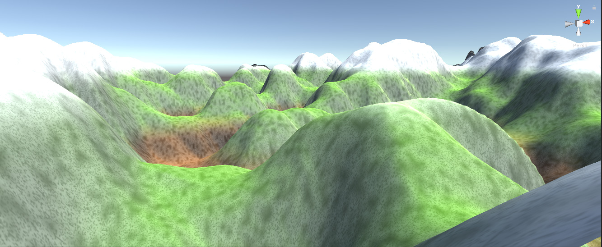

# Unity Blender Terrain Tools

## Disclaimer

This is an unfinished toolset for automatically creating terrains within unity.

<iframe src="https://player.vimeo.com/video/100384837" width="640" height="360" frameborder="0" webkitallowfullscreen mozallowfullscreen allowfullscreen></iframe>

<a href="https://vimeo.com/100384837">Highres Blender Mesh to Unity3D Terrain</a> from <a href="https://vimeo.com/kaiwegner">Kai Wegner</a> on <a href="https://vimeo.com">Vimeo</a>.

## Contents

### Terra Generator

See entry point `Assets/Terra/scenes/TerrainGenerator.unity`

#### Component `TerraGenerator.cs`

Can be used to generate a terrain. Use a serious of TerrainGenerators such as Perlin noise, perturbation, eroding and smoothing to generate a terrain in unity.

#### Component `ApplyTextures.cs`

Applies a set of textures to a terrain based on height and steepness using the splatmap system in unity.

#### Component `ApplyHeightmap.cs`

Applies a generated heightmap (either texture or text asset) to a terrain in unity.

#### Blender Python Script `export_heightmap.pyblend`

Used to create a text asset for import in unity using `ApplyHeightmap.cs`.

### Terrain From Mesh

#### Shader `terrain.shader`

Vertex color and a custom rim light color are used in this shader.

#### Component `TerrainFromMeshComponent.cs`

This tool traces a references GameObject by shooting a series of rays down on it. The resulting height values are transformed into a terrain. Please watch this video for an impression of how this works: [TerrainGeneration](https://vimeo.com/100384837)

#### Blender Python Script `flatten_mesh.pyblend`

This can be used to split a smooth mesh with a vertex color channel into a flat shaded and still nicely colored mesh.

#### Blender Python Script `split_terrain_2.pyblend`

This can be used to split a huge mesh into separate chunks to allow for view frustum culling and to avoid hitting the 65k vertices limit within unity.

